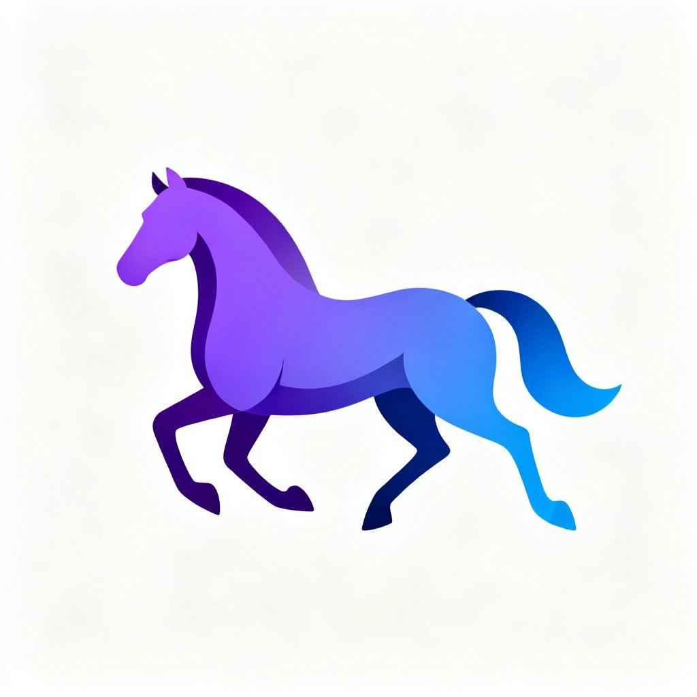

# NoFile

> A floating macOS file dock for screenshots, downloads, drag-and-drop files, and clipboard images.

[](https://github.com/HXZ09845/nofile/actions/workflows/build.yml)
[](LICENSE)

NoFile is a lightweight Electron desktop app that watches your Desktop and Downloads folders, catches new files as they appear, and keeps them in a small always-on-top dock. It is designed for people who constantly move screenshots, downloaded assets, and copied images between chat apps, design tools, documents, and browsers.

The project is in an early open-source state. It builds from source today; packaged public releases are on the roadmap.

<p align="center">
  
</p>

## What It Does

- Watches Desktop and Downloads for newly created supported files.
- Captures copied clipboard images into temporary PNG files.
- Shows recent items in list, grid, and compact views.
- Lets you drag files from the dock into other apps.
- Opens files, reveals files in Finder, copies images, previews media, and renames files.
- Supports lightweight virtual folders inside the dock for quick grouping.
- Keeps the app in a floating, always-on-top window.

## Why It Exists

Screenshots and downloaded files often pile up before they are moved into the right conversation, document, or design file. NoFile acts as a small staging shelf: capture first, organize or move later.

## Requirements

- macOS
- Node.js 20 or newer
- npm

The app is currently configured for macOS packaging through `electron-builder`.

## Quick Start

```bash
git clone https://github.com/HXZ09845/nofile.git
cd nofile
npm install
npm run dev
```

## Build From Source

```bash
npm run build
```

This compiles the Electron main process, preload script, and React renderer into `dist/`.

## Package For macOS

```bash
npm run package
```

Packaged macOS builds are written to `release/`. Release artifacts are intentionally ignored by Git.

## Project Structure

```text
src/
  main/       Electron main process, file watcher, clipboard watcher, IPC handlers
  preload/    Safe bridge APIs exposed to the renderer
  renderer/   React UI for the floating dock
build/        App icon assets used by electron-builder
```

## Development Notes

- The file watcher listens to Desktop and Downloads by default.
- Clipboard images are stored under the system temp directory.
- The renderer talks to Electron through `window.electronAPI` from the preload script.
- Generated folders such as `dist/`, `release/`, and `node_modules/` are not committed.

## Roadmap

See [ROADMAP.md](ROADMAP.md) for planned work. Near-term priorities include real screenshots in the README, a first tagged GitHub release, settings polish, and more predictable file persistence.

## Contributing

Contributions are welcome. Start with [CONTRIBUTING.md](CONTRIBUTING.md), then open an issue or pull request.

## Security

Please report security concerns through the process in [SECURITY.md](SECURITY.md). Do not open public issues for vulnerabilities.

## License

NoFile is released under the [MIT License](LICENSE).
